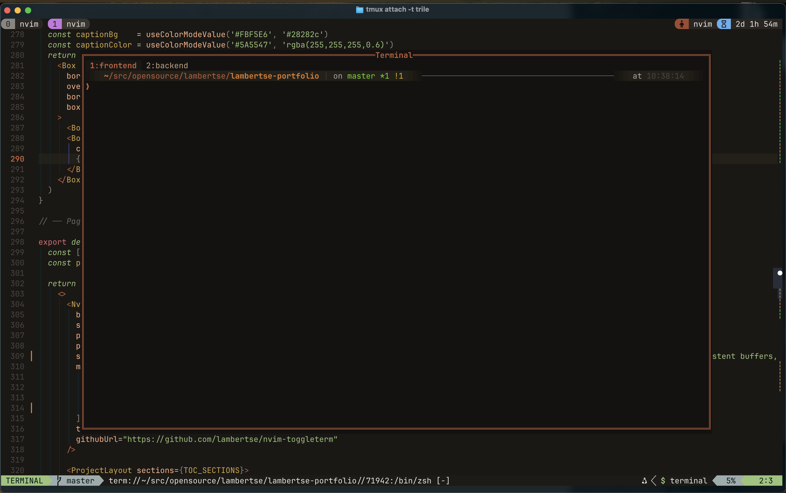

# nvim-toggleterm

A tiny, dependency‑free Neovim plugin to open/toggle a floating terminal centered on your screen.
It supports multiple concurrent terminal sessions with a built-in tab bar, per-session naming, and keyboard shortcuts for fast navigation.

> ✅ Works with Neovim 0.8+ (optional window title on 0.9+) \
> 🧩 Zero deps, pure Lua \
> 🪟 Floating window with configurable border, size, and title \
> 🗂 Multiple named terminal sessions with a winbar tab bar \
> ⌨️ Optional user commands + keymaps for session management \
> 🧠 Reuses terminal buffers — switching sessions is instant \
> 🔄 Auto-resizes on VimResized \
> 🧼 Auto-closes or switches sessions when a shell job exits (configurable) \

## Screenshots



## Requirements
- **Neovim**: 0.8 or newer
  - Optional: **0.9+** to display a floating window border title

## Installation
### lazy.nvim
```lua
{
  "lambertse/nvim-toggleterm",
  config = function()
    require("nvim-toggleterm").setup({
      -- see full options below
      width = 0.8,
      height = 0.8,
      border = "rounded",
      start_in_insert = true,
      create_user_command = true,
      create_keymap = true,
      keymap = "<leader>tt",
      close_on_job_exit = true,
      title = "Terminal",
    })
  end,
}
```

### packer.nvim
```lua
use({
  "lambertse/nvim-toggleterm",
  config = function()
    require("nvim-toggleterm").setup()
  end,
})
```
### vim-plug
```
Plug 'lambertse/nvim-toggleterm'
```
Then in your init.lua:
```lua
require("nvim-toggleterm").setup()
```

## Quick Start
Once installed, toggle the floating terminal:
```
:FloatingTerminalToggle
```

Inside the terminal window, use the default keymaps:

| Key | Action |
|-----|--------|
| `<A-n>` | New terminal session |
| `<A-x>` | Close current session |
| `<A-l>` | Next session |
| `<A-h>` | Previous session |
| `<A-r>` | Rename current session (prompts for name) |

These work in both **normal** and **terminal** mode inside the floating window.

## Configuration
```lua
require("nvim-toggleterm").setup({
  width  = 0.8,           -- fraction of columns (0 < x <= 1)
  height = 0.8,           -- fraction of lines    (0 < x <= 1)
  border = "double",      -- "single"|"double"|"rounded"|"solid"|"shadow"|table
  start_in_insert     = true,  -- enter insert mode after opening/switching
  create_user_command = true,  -- register :FloatingTerminal* commands
  create_keymap       = false, -- register the global toggle keymap
  keymap              = "<leader>tt", -- global toggle key (normal mode)
  close_on_job_exit   = true,  -- switch/close when the shell job exits
  title               = "Terminal", -- border title (Neovim 0.9+); nil to hide

  -- Buffer-local keymaps (normal + terminal mode, scoped to each session buffer).
  -- Set any to "" or nil to disable individually.
  keymap_new           = "<A-n>",
  keymap_close_session = "<A-x>",
  keymap_next          = "<A-l>",
  keymap_prev          = "<A-h>",
  keymap_rename        = "<A-r>",
})
```

## Commands
Created when `create_user_command = true`:

**Window control**
- `:FloatingTerminalOpen` – Open (or focus) the terminal window.
- `:FloatingTerminalClose` – Hide the floating window (all session buffers persist).
- `:FloatingTerminalToggle` – Toggle open/close.
- `:FloatingTerminalResize` – Recompute geometry and apply.

**Session management**
- `:FloatingTerminalNew [name]` – Create a new session (optional name argument).
- `:FloatingTerminalCloseSession` – Close the active session (switches to adjacent or closes window).
- `:FloatingTerminalNext` – Switch to the next session.
- `:FloatingTerminalPrev` – Switch to the previous session.
- `:FloatingTerminalSwitch {n}` – Switch to session by 1-based index.
- `:FloatingTerminalRename [name]` – Rename the active session (prompts if no argument).

## Lua API
```lua
local tt = require("nvim-toggleterm")

tt.open()                      -- open / focus
tt.close()                     -- hide window
tt.toggle()                    -- toggle
tt.resize()                    -- recompute geometry

tt.new_terminal("build")       -- new named session
tt.close_terminal()            -- close active session
tt.next_terminal()             -- next session
tt.prev_terminal()             -- previous session
tt.switch_terminal(2)          -- switch to session #2
tt.rename_terminal("deploy")   -- rename (string or nil to prompt)
tt.get_sessions()              -- { { id, name, active }, ... }
tt.is_open()                   -- boolean
```

## Contributing
PRs and issues are welcome!
Please keep changes small and focused, and add docs/notes for new behaviors.

- Fork and create a feature branch.
- Add/adjust unit/integration tests if applicable.
- Update README for any new options (keep the `M.defaults` table in `config.lua` in sync).
- Open a PR with a clear description.

## License
MIT — do whatever you want, just keep the license and attribution.
